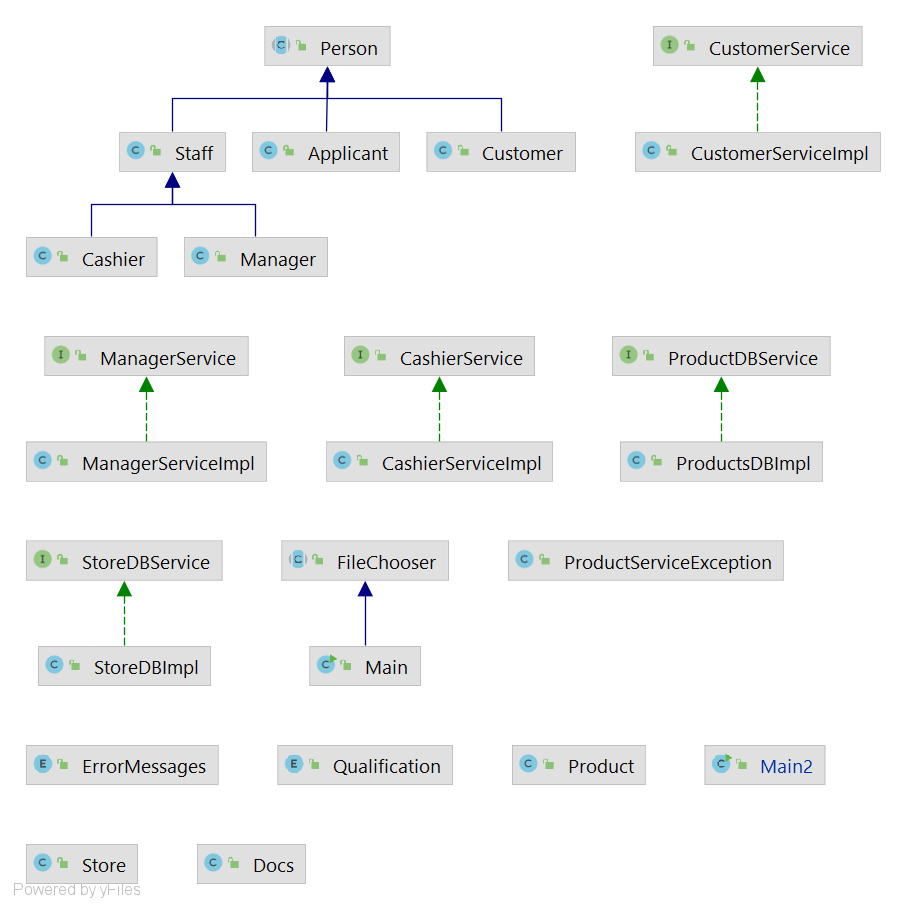
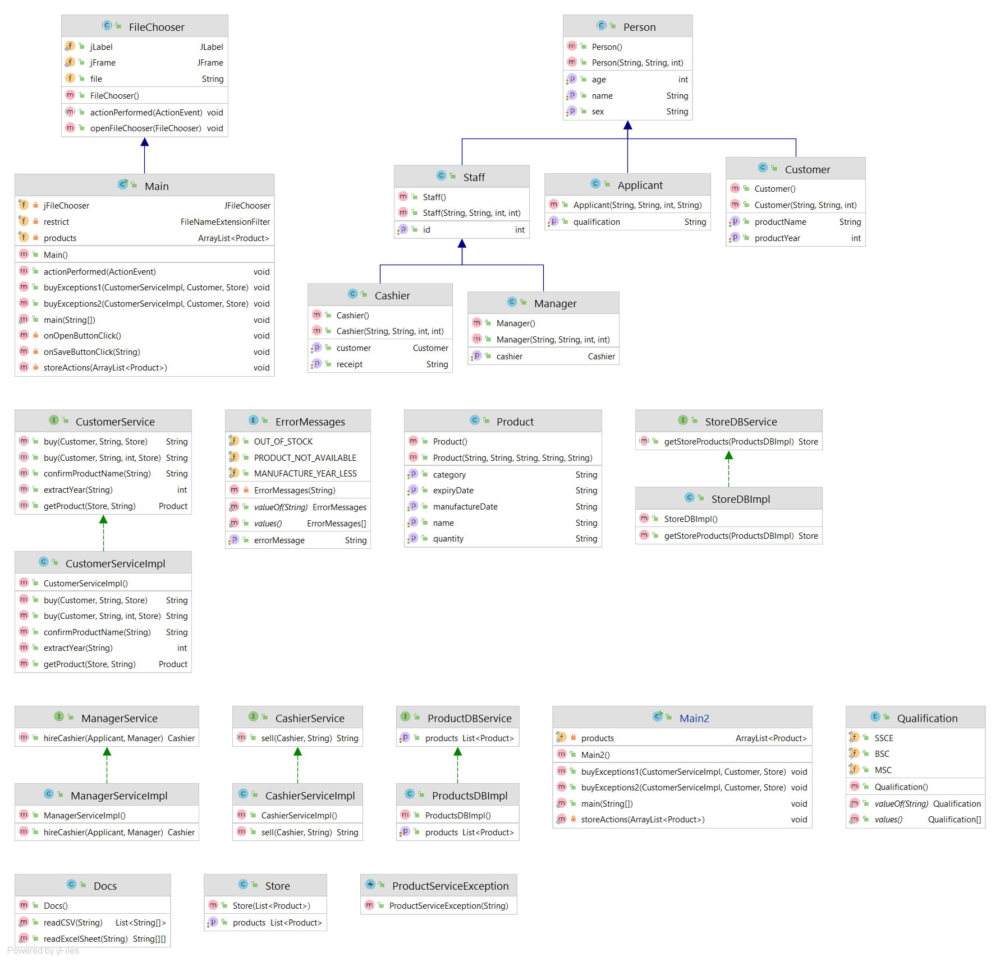
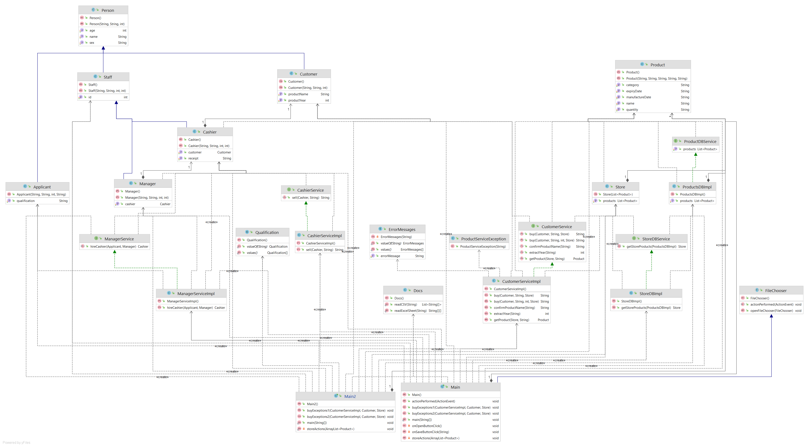

# week-four-sq012 
STORE SALES AND MANAGEMENT (MULTI-THREADED STORE)

<h3><u>Problem Description</u></h3>
Use your understanding of threads and concurrency to implement sales and purchases in your store application, allowing multiple customers to purchase products from your store. Prevent various problems associated with multi-threading such as race conditions, deadlock.

Reading product data from an Excel sheet/CSV file and storing it as an array of product objects for a sample store. Products are categorized for easy access by the cashier and customers. Product out of stock are made as “OUT OF STOCK” to prevent the purchase of products that are not available.

